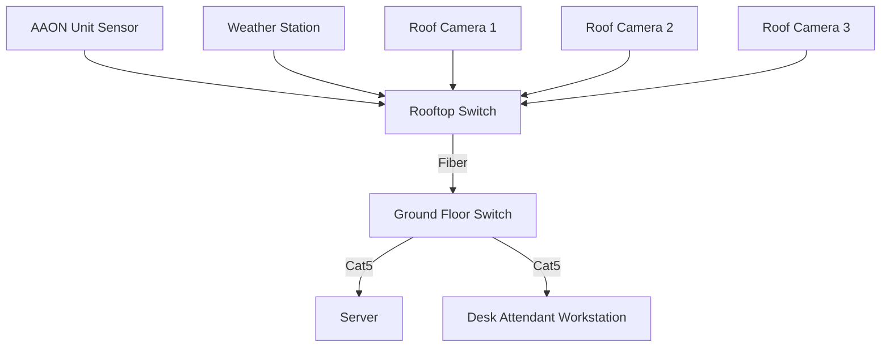

```mermaid
graph TD
    A1[AAON Unit Sensor] --> SW1[Rooftop Switch]
    A2[Weather Station] --> SW1
    A3[Roof Camera 1] --> SW1
    A4[Roof Camera 2] --> SW1
    A5[Roof Camera 3] --> SW1

    SW1 -->|Fiber| SW2[Ground Floor Switch]
    SW2 -->|Cat5| SRV[Server]
    SW2 -->|Cat5| WS[Desk Attendant Workstation]
```
