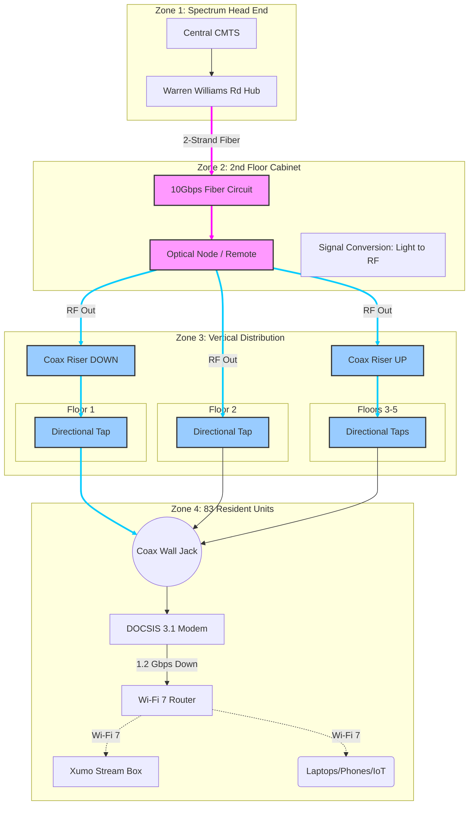

# Infrastructure Assessment: Eagle & Phenix Mill 3
**Date:** February 3, 2026
**Reference:** Jan 30 Meeting (Jesse Ovdenk - Spectrum / Bill Johnson - TSG)

## System Overview
The building operates on a **Fiber-to-the-Node (FTTN)** model. The critical "Node" (Optical Receiver) is located physically in the **2nd Floor Cabinet**, not in the basement or on the street.

---

## Technical Description (Network Topology)

### Zone 1: External Backbone
*   **Source:** Spectrum Head End (Warren Williams Road).
*   **Transport:** Dedicated 10 Gbps Fiber Optic circuit (2-strand TX/RX).

### Zone 2: Demarcation (2nd Floor Cabinet)
*   **Location:** 2nd Floor Utility Cabinet.
*   **Hardware:** Optical Node ("The Remote").
*   **Process:** Fiber enters here and is converted to RF (Coaxial) signals.
*   **Status:** Signals here are rated "Perfect/Clean".

### Zone 3: Internal Distribution (IDFs)
*   **Flow:** RF signals are distributed from the 2nd Floor Node:
    *   **Down** to 1st Floor.
    *   **Up** to Floors 3, 4, and 5.
*   **Media:** Shielded Coaxial Riser cables.
*   **Hardware:** Directional Taps (Splitters) located in hallway utility closets.
*   **Correction Note:** Taps on Floors 2-5 were previously sub-optimal; tap dB values were recently "shut around" (adjusted) to correct low signal levels.

### Zone 4: Resident Units (x83)
*   **Modem:** DOCSIS 3.1 (Supports 1.2 Gbps Download).
*   **Roadmap:** 2027 "High Split" upgrade will enable **Symmetric 1Gbps/1Gbps** speeds.
*   **Video:** Xumo Stream Boxes (Full IP-based streaming).
*   **Wi-Fi:** Target move to managed Wi-Fi 7 hardware to resolve unit-level "blind spots."

---

## Infrastructure Diagram (Mermaid)

